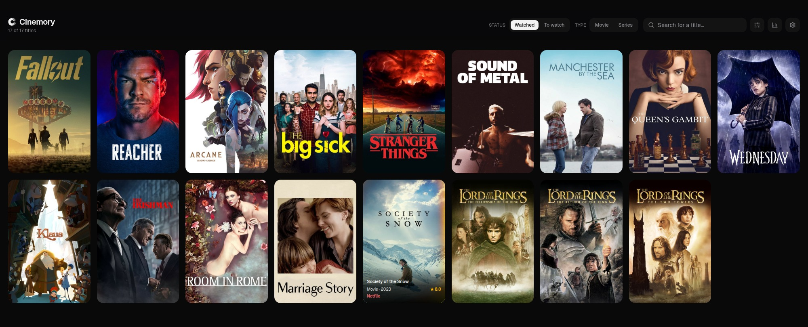
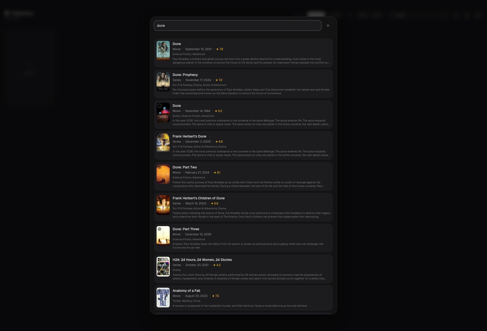

# Cinemory

[](LICENSE)
[](https://github.com/ldtnz/cinemory/stargazers)

A personal catalog for everything you have watched on Netflix, Prime Video,
Disney+ or at the cinema. Import your streaming history, browse and filter it,
track how many seasons of a series you have got through, and let
[TMDB](https://www.themoviedb.org) fill in posters, ratings, genres and years.

It is an installable PWA: add it to your phone's home screen and it opens like
an app, with an offline fallback and cached posters.

**Stack:** Next.js 16 (App Router) · React 19 · TypeScript · Tailwind CSS v4 ·
Prisma + SQLite / [Turso](https://turso.tech) · Serwist (service worker).

[](https://vercel.com/new/clone?repository-url=https%3A%2F%2Fgithub.com%2Fldtnz%2Fcinemory&env=TMDB_ACCESS_TOKEN,SESSION_SECRET,TURSO_DATABASE_URL,TURSO_AUTH_TOKEN&envDescription=See%20the%20README%20for%20how%20to%20get%20each%20value&envLink=https%3A%2F%2Fgithub.com%2Fldtnz%2Fcinemory%23environment-variables&project-name=cinemory&repository-name=cinemory)

No `TOTP_SECRET` to generate up front: sign-in is set up from the app itself
on first run — see [Getting the credentials](#getting-the-credentials) below
for how to get the values Vercel will ask for.

<p align="center">
  
  
</p>

---

## Features

- **Catalog** — one grid for every title, filtered by platform and by
  movie/series, searchable, sortable by date watched, title, TMDB rating or
  release year.
- **History import** — upload your Netflix and Prime Video exports; only titles
  that are not already in the catalog get added, so you can re-import after
  every new export.
- **Seasons** — series show "3 of 5 seasons"; the totals come from TMDB, the
  watched count from your history, and you can adjust it by hand.
- **Add a title** — search TMDB as you type and add anything, pick the platform
  you watched it on.
- **TMDB enrichment** — posters, backdrops, overviews, ratings, genres, years,
  season counts.
- **Maintenance** — a settings page for importing, merging series split across
  rows, fixing missing posters, and an edit mode for deleting titles.
- **Single-user auth** — a 6-digit TOTP code from your authenticator app; no
  passwords, no accounts, no third-party sign-in.
- **Setup wizard** — the first time you open the app it asks for a content
  language/region and walks you through scanning a QR code into your
  authenticator app. No secrets to generate or configure by hand.

## Choose how to run it

|  | **Self-hosted** | **Serverless (Vercel & co.)** |
|---|---|---|
| Database | SQLite file on a volume | Turso (hosted libSQL) |
| Cost | your own machine | free tiers are enough |
| Setup | `docker compose up` | connect the repo, set env vars |
| Best when | you have a NAS, VPS or home server | you want a URL and no server |

Both run the exact same code — only the database differs, and that is decided
by whether `TURSO_DATABASE_URL` is set.

---

## Option A — Self-hosted with Docker

```bash
git clone https://github.com/ldtnz/cinemory.git
cd cinemory
cp .env.example .env      # fill in SESSION_SECRET, TMDB_ACCESS_TOKEN
docker compose up -d --build
```

The app is on http://localhost:3000. The database is a SQLite file on the
`cinemory-data` volume, and the container applies the migrations on every
start, so a fresh volume just works. The first request opens the setup
wizard — pick a content language/region, then scan the QR code to finish.

To update:

```bash
git pull
docker compose up -d --build
```

## Option B — Self-hosted with plain Node

Node 22 or newer.

```bash
git clone https://github.com/ldtnz/cinemory.git
cd cinemory
npm install
cp .env.example .env      # fill in SESSION_SECRET, TMDB_ACCESS_TOKEN

npx prisma migrate deploy # creates prisma/dev.db with the schema
npm run build
npm start                 # http://localhost:3000
```

For development use `npm run dev` instead of `build` + `start`.

## Option C — Vercel + Turso

1. **Create the database.** Sign up at [turso.tech](https://turso.tech)
   (the free tier is plenty), then:

   ```bash
   turso db create cinemory
   turso db show cinemory --url        # -> TURSO_DATABASE_URL
   turso db tokens create cinemory     # -> TURSO_AUTH_TOKEN
   ```

2. **Create the schema.** With both values in your local `.env`:

   ```bash
   npm install
   npm run db:migrate-turso
   ```

3. **Deploy.** Import the repository on [vercel.com](https://vercel.com) and
   add these environment variables to the project: `SESSION_SECRET`,
   `TMDB_ACCESS_TOKEN`, `TURSO_DATABASE_URL`, `TURSO_AUTH_TOKEN`. Deploy, then
   open the app: the first visit opens the setup wizard, which stores its
   own content language/region and TOTP secret in that Turso database.

Whenever the schema changes, run `npm run db:migrate-turso` again before
deploying — `prisma migrate deploy` talks to a SQLite file, not to Turso.

---

## Environment variables

Every variable is documented in [`.env.example`](.env.example). In short:

| Variable | Required | What it is |
|---|---|---|
| `SESSION_SECRET` | yes | random string used to sign the session cookie |
| `TMDB_ACCESS_TOKEN` | yes* | TMDB v4 "API Read Access Token" |
| `TMDB_API_KEY` | yes* | TMDB v3 "API Key" — the alternative to the token |
| `DATABASE_URL` | self-hosted | path to the SQLite file |
| `TURSO_DATABASE_URL` | serverless | libSQL endpoint; when set, it wins over `DATABASE_URL` |
| `TURSO_AUTH_TOKEN` | serverless | token for that database |

\* one of the two TMDB credentials. Nothing is baked into the client bundle:
every TMDB call goes through the app's own API routes, so the key stays on the
server.

The TOTP secret and the content language/region are not environment variables
at all — the setup wizard on first run stores them in the database. Only
`SESSION_SECRET`, the key that signs the session cookie, stays outside the
database: keeping it there means a leaked database alone cannot be used to
forge a session, only to read the catalog and the (equally database-stored)
TOTP secret.

### Getting the credentials

**TMDB (free).** Create an account at
[themoviedb.org/signup](https://www.themoviedb.org/signup), then go to
[Settings → API](https://www.themoviedb.org/settings/api) and request a
"Developer" key for personal use. Copy the **API Read Access Token** into
`TMDB_ACCESS_TOKEN` (or the shorter **API Key (v3 auth)** into `TMDB_API_KEY`).

**SESSION_SECRET.** Any long random string:

```bash
node -e "console.log(require('crypto').randomBytes(32).toString('hex'))"
```

---

## Getting your data in

### From the app (recommended)

Open **Settings** (the gear, top right) → **Import watch history** and upload
one or both CSVs. The format is detected from the header, and only titles that
are not already in the catalog are added — so importing the same file twice
changes nothing. Posters and metadata are fetched right afterwards.

### Where the exports come from

- **Netflix** — Account → Profile → Viewing activity → *Download all*. You get
  a `NetflixViewingHistory.csv` with two columns: `Title,Date`.
- **Prime Video** — Amazon has no built-in export. Use
  [Watch History Exporter for Amazon Prime Video](https://github.com/caret-collective/watch-history-exporter-for-amazon-prime-video):
  open primevideo.com/settings/watch-history, paste the script into the browser
  console and run it.
- **IMDb** (optional) — Your Ratings → Export. Handled by a script rather than
  the UI, see below.

`prisma/seed-data/` ships a few fake `*.example.csv` files showing exactly what
each format looks like. Your own exports go in the same folder under the names
without `.example`, and are git-ignored.

### From the command line

```bash
npm run db:seed     # wipes the catalog and rebuilds it from the two CSVs
npm run db:enrich   # fetches posters/ratings/genres for anything missing them
```

`db:seed` **replaces** the catalog, so it is for the first build; afterwards use
the incremental import in the app. `db:enrich -- --force` re-fetches everything
rather than just the new titles.

For IMDb ratings there is a separate script that looks each title up by its
exact IMDb ID and guesses the platform from TMDB's streaming providers:

```bash
npx tsx scripts/import-imdb.ts --dry-run   # report only, writes nothing
npx tsx scripts/import-imdb.ts
```

---

## Project layout

```
prisma/schema.prisma        the data model (one Title table)
prisma/migrations/          SQL migrations
prisma/seed.ts              builds the catalog from the CSVs
prisma/seed-data/           your exports + the bundled fake samples
scripts/enrich-tmdb.ts      fills in TMDB data for existing titles
scripts/import-imdb.ts      imports an IMDb ratings export
scripts/sync-turso.ts       pulls Turso down into the local dev.db
scripts/migrate-turso.ts    applies prisma/migrations to Turso
src/app/page.tsx            the catalog page (server component)
src/app/settings/           import, seasons, missing posters, edit mode
src/app/api/                TMDB search, import, seasons, titles, login
src/app/sw.ts               service worker (offline + poster cache)
src/components/             Catalog, FilterBar, TitleCard, AddTitleCard, …
src/lib/history.ts          parses the Netflix and Prime Video exports
src/lib/tmdb.ts             the TMDB client
src/lib/prisma.ts           shared Prisma client (SQLite or Turso)
src/lib/auth.ts             TOTP verification and session cookie
```

## npm scripts

| Script | What it does |
|---|---|
| `npm run dev` | development server (syncs from Turso first, if configured) |
| `npm run build` / `npm start` | production build and server |
| `npm run lint` | ESLint |
| `npm run db:seed` | rebuild the catalog from the CSV exports |
| `npm run db:enrich` | fetch TMDB data for titles that have none |
| `npm run db:sync` | copy the Turso database down into `prisma/dev.db` |
| `npm run db:migrate-turso` | apply `prisma/migrations` to Turso |

## Notes on the database

The app picks its database at runtime: if `TURSO_DATABASE_URL` is set it goes
through Prisma's libSQL adapter to Turso, otherwise it uses the local SQLite
file. That is the only difference between the two deployment options — same
schema, same queries, same migrations.

`prisma/dev.db` is git-ignored: it holds your own catalog.

## Privacy

Your watch history stays in your own database. The only outbound calls are to
TMDB, for the title you are searching for or enriching, and TMDB's image CDN
for posters. There is no analytics, no telemetry and no third-party account.

## License

[GNU AGPLv3](LICENSE) — free to use, copy and modify. If you distribute a
modified version, or run one as a network service, you must make that
version's source available to your users under the same license: see the
license text for the exact terms.
