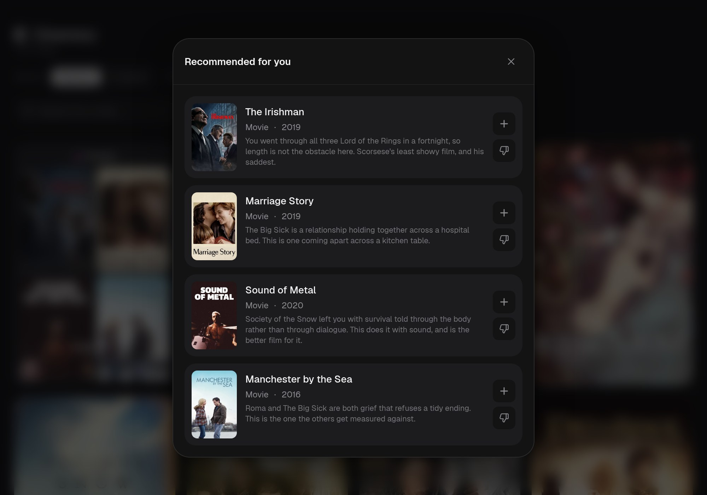
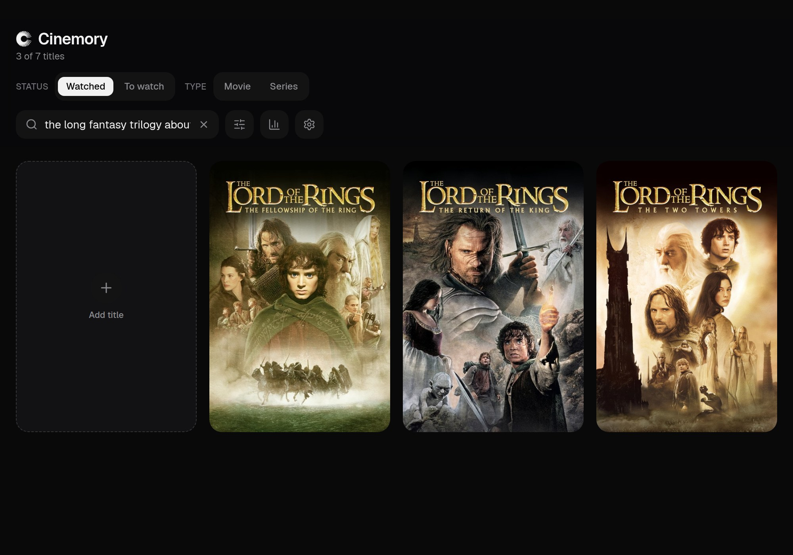
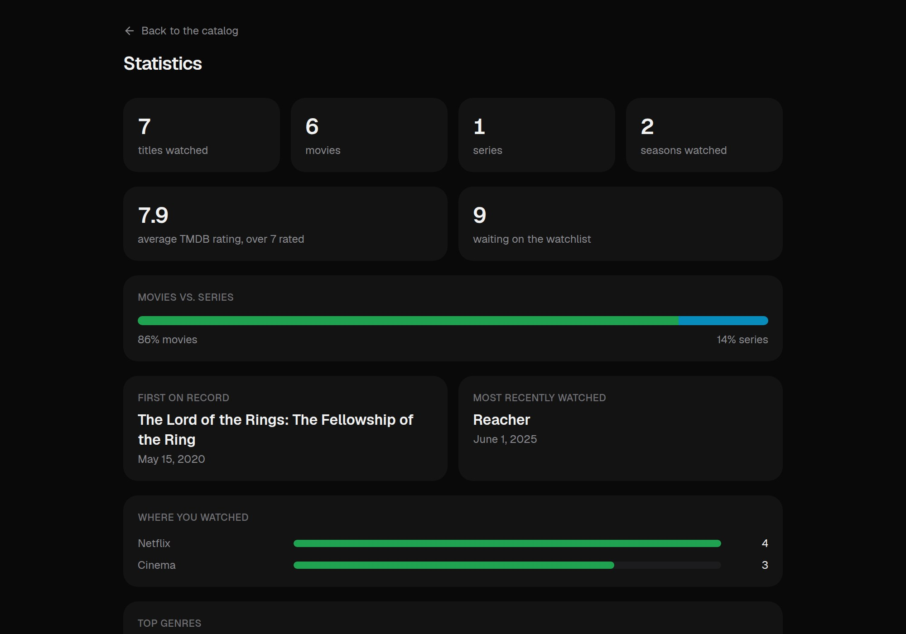
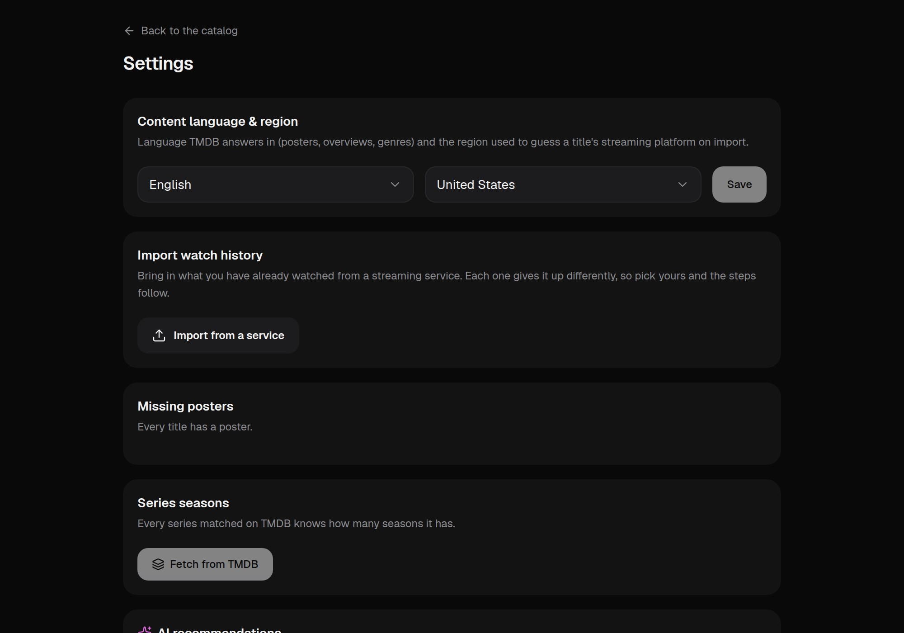

# Cinemory

A personal catalog for everything you have watched on Netflix, Prime Video,
Disney+ or at the cinema. Import your streaming history, browse and filter it,
track how many seasons of a series you have got through, and let
[TMDB](https://www.themoviedb.org) fill in posters, ratings, genres and years.
Optionally, [Claude](https://www.anthropic.com/claude) looks at your catalog
and suggests what to watch next, refreshing itself automatically every few
days.

It is an installable PWA: add it to your phone's home screen and it opens like
an app, with an offline fallback and cached posters.

**Stack:** Next.js 16 (App Router) · React 19 · TypeScript · Tailwind CSS v4 ·
Prisma + SQLite / [Turso](https://turso.tech) · Serwist (service worker).

Sign-in is set up on first run: the app generates its own secret, shows a QR
code to scan into an authenticator app, and stores it once you type back the
code it produces. There is no password to choose and no account to create.

  
    
  

  
  
  
  

---

---

## Features

- **Catalog** — one grid for every title, filtered by platform and by
  movie/series, searchable, sortable by date watched, title, TMDB rating or
  release year.
- **History import** — a dialog per service: Netflix, Prime Video, IMDb (with
  your ratings) and a Disney+ watchlist, each with what to click to get the
  file. Only titles that are not already in the catalog get added, so you can
  re-import after every new export.
- **Seasons** — series show "3 of 5 seasons"; the totals come from TMDB, the
  watched count from your history, and you can adjust it by hand.
- **Add a title** — search TMDB as you type and add anything, pick the platform
  you watched it on.
- **Watchlist** — a Watched / To watch switch; in "To watch" the search browses
  all of TMDB (hiding what you have already seen) and a click adds it. Right-
  click a waiting title and "Mark as watched" moves it over.
- **Statistics** — how much you watched and where, your top genres, titles per
  year, which decades they come from and your best-rated titles.
- **TMDB enrichment** — posters, backdrops, overviews, ratings, genres, years,
  season counts.
- **AI recommendations** *(optional)* — Claude suggests titles to watch next
  based on your catalog, refreshing itself automatically every 5 days (every
  batch kept as history); click one to watch its trailer. In "To watch" they
  appear as a strip you can add from in one click, and "not interested" on any
  of them keeps it out of every future batch. Off by default, enabled by
  setting `ANTHROPIC_API_KEY`.
- **MCP connector** *(optional)* — an MCP endpoint that lets an AI assistant
  read this catalog during an ordinary chat: what you have watched, what is
  waiting, and the numbers behind it — and add to it, if you hand out a
  credential that may. Off until you switch it on, and revocable in a click.
  See [docs/mcp.md](docs/mcp.md).
- **Maintenance** — a settings page for importing, merging series split across
  rows, fixing missing posters, exporting the whole catalog as JSON, and an
  edit mode for deleting titles.
- **Single-user auth** — a 6-digit TOTP code from your authenticator app; no
  passwords, no accounts, no third-party sign-in.
- **Setup wizard** — the first time you open the app it asks for a content
  language/region and walks you through scanning a QR code into your
  authenticator app. No secrets to generate or configure by hand.

---

## Run your own

The button needs a database to point at, so read
**[docs/deploy-vercel.md](docs/deploy-vercel.md)** first — it walks through the
whole thing from nothing, without a terminal, in about fifteen minutes. It also
covers the one choice worth making up front: the button *copies* this
repository, so if you want later updates to be a single click, fork it instead
and import the fork. Same amount of clicking.

| Guide | For |
|---|---|
| [**Vercel + Turso**](docs/deploy-vercel.md) | a URL on your phone, no server of your own, free tiers throughout |
| [**Docker**](docs/docker.md) | a NAS, a VPS or a home server — SQLite on a volume, nothing external |
| [**Local development**](docs/development.md) | working on the code |
| [Environment variables](docs/environment.md) | what each value is and where to get it |
| [MCP connector](docs/mcp.md) | letting an AI assistant read the catalog in a chat |

Both deployments run the same code; only the database differs, and that is
decided by whether `TURSO_DATABASE_URL` is set.

---

## Getting your data in

Open **Settings** → **Import watch history** → **Import from a service** and
pick where you are coming from — Netflix, Prime Video, IMDb or a Disney+
watchlist. The dialog shows how to get that service's export, what the file
looks like, and whether it lands in your watched titles or in "To watch".

Only titles that are not already in the catalog are added, so importing the
same file twice changes nothing, and re-importing after every new export is the
intended way to keep it current. Posters and details are fetched straight
after.

Titles TMDB cannot match — streaming exports write names like
`The Office: Season 3` — land in **Settings → Missing posters**, where you can
search for the right artwork by hand or tell the app to stop asking.

There are command-line paths too, including an IMDb importer that matches on
the exact IMDb ID rather than by name: see
[docs/development.md](docs/development.md#loading-a-catalog-from-the-command-line).

---

## Privacy

Your watch history stays in your own database. The only outbound calls are to
TMDB, for the title you are searching for or enriching, and TMDB's image CDN
for posters. There is no analytics, no telemetry and no third-party account.

## License

[GNU AGPLv3](LICENSE) — free to use, copy and modify. If you distribute a
modified version, or run one as a network service, you must make that
version's source available to your users under the same license: see the
license text for the exact terms.
